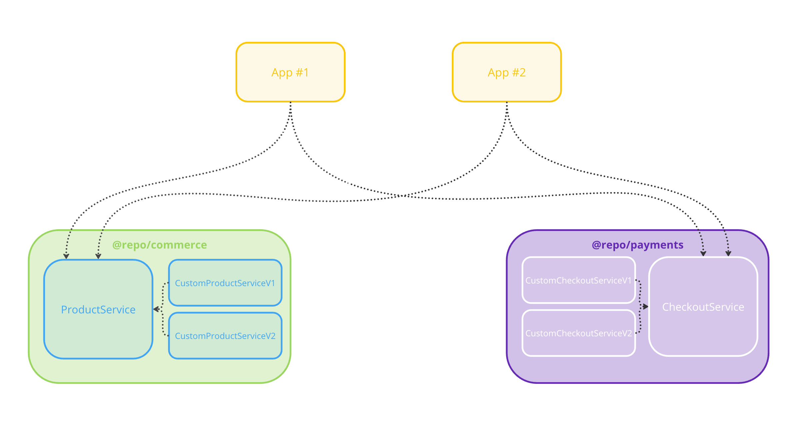
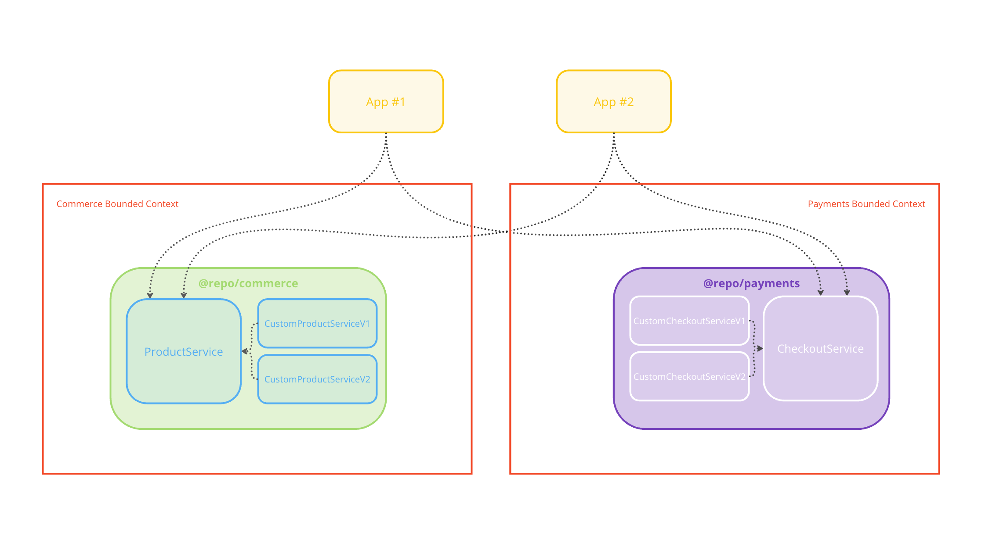

# Hexagonal Architecture 🤝🏼 Turborepo

## Getting Started

This example is composed of two Next.js applications, two ports (_commerce engine and payment processor_), and two adapters (_implementation of a commerce engine and implementation of a payment processor_)

To start using, you can use the following commands:

```zsh
pnpm install

pnpm dev

pnpm build

pnpm test
```

This project also has some configured some tools like:

- [TypeScript](https://www.typescriptlang.org/) for static type checking
- [Jest](https://jestjs.io/) for unit testing
- [ESLint](https://eslint.org/) for code linting
- [Prettier](https://prettier.io) for code formatting

## Applications

Located under `/apps`, you will find two applications.

- `app-one`: a simple [Next.js](https://nextjs.org/) app
- `app-two`: another simple [Next.js](https://nextjs.org/) app

## Domain Driven Design

In this simple example, I want to try to use DDD to emphasize and demonstrate a few points.  In this example, I think it's fair to say that the **Domains** are Commerce and Payments.

Located under `/packages`, you will find two '*domains*' (`@repo/commerce` and `@repo/payments`) which handle the interactions between the applications and the implementations of the integrations.

- `@repo/commerce`: encompasses interactions to a commerce engine used by both `app-one` and `app-two` applications
- `@repo/payments`: encompasses interactions to a payment processor used by both `app-one` and `app-two` applications

## Subdomains

Within E-commerce, there are many smaller, individual domains, called **Subdomains**.  For example, within the Commerce Domain, there could be Subdomains such as Products, Customers, Carts, Orders, etc.

Located *each* domain `/packages`, you will find two services that expose the '*subdomains*':

- `ProductService`: defines interactions between `app-one` & `app-two` *AND* the implementation of `CustomProductService`
- `CheckoutService`: defines interactions between `app-one` & `app-two` *AND* the implementation of `CustomCheckoutService`


### Dependency Inversion

The goal of the `/packages/commerce` and `/packages/payments` is to achieve a form of [Dependency Inversion](https://tanzu.vmware.com/developer/blog/write-more-maintainable-testable-code-with-dependency-injection/) by defining an interfaces by which the depending applications (and the custom integrations depend on).

These interfaces are called Ports.

By exposing an interface via the package, this allows the two `app`s to depend on the interface, while the implementation (ie: `ProductService` or `CheckoutService`) **ALSO** depend on the interface.  This effectively achieves Dependency Inversion because BOTH the `app-one` and the `CustomProductService` are dependent on the `ProductService`.

`app-one` -> `@repo/commerce` (`ProductService` <- `CustomProductService`)

This can also be applied to the `@repo/payments` domain as well:

`app-one` -> `@repo/payments` (`CheckoutService` <- `CustomCheckoutService`)



### Bounded Contexts

Futhermore, the organization and dependency inversion of `@repo/commerce` and `@repo/payments` creates a [Bounded Context](https://martinfowler.com/bliki/BoundedContext.html) (aka domain aggregates).  This helps keep each Subdomain small and modular ('_the boundary will help sub domain focus to do only 1 thing and do well_').  Taking the diagram above, you can draw this in like so:




### Benefits
Often with applications with a large amount of dependencies and integrations, the application becomes highly coupled to the implementation of the integration itself. In this case, the commerce engine and the payment processor.

However, dependency inversion allows for the decoupling of the applications and these integrations by defining the domain of which they relate; allowing for easier testing, greater flexibility, and cleaner design as in the future it can make the change/swap of an integration much simpler - without the consuming application needing to know (or care).


## Implementations

Located under each`/packages/**` domain, you will find an '_implementation(s)_' which handle the specific implementation details of each integration. This is called an adapter.  An adapter will be dependent on the interface/contract provided by the respective port.


## Shared Configuration

Located under `/packages/config` is all of the shared configuration which the Turborepo uses. This is a great space to put handy developer tools and code cleanliness configuration.

- `@repo/eslint-config`: `eslint` configurations (includes `eslint-config-next` and `eslint-config-prettier`)
- `@repo/jest-config`: `jest` configurations for `browser` and `node` configurations
- `@repo/typescript-config`: `tsconfig.json`s used throughout the monorepo

## Useful Architecture Links
- [Dependency Injection](https://tanzu.vmware.com/developer/blog/write-more-maintainable-testable-code-with-dependency-injection/)
- [Dependency Inversion](https://tanzu.vmware.com/developer/blog/write-more-maintainable-testable-code-with-dependency-injection/)
- [Domain Driven Design](https://www.amazon.com/Domain-Driven-Design-Tackling-Complexity-Software/dp/0321125215)
- [Domain Driven Design Distilled](https://www.amazon.com/Domain-Driven-Design-Distilled-Vaughn-Vernon/dp/0134434420/ref=sr_1_1?crid=18YX1CM0VZZ2I&dib=eyJ2IjoiMSJ9.V38g5Do5w5nrE6OQbkJUMAIMZ5R0jvlcHZNXNSwxAsN6Cvp7aoGHTmGnqMSIzAkIO64RYPifAb88wqe9ypUnBwkICYx44hb1nu14DzrZV9A.N6Y0NsIsh-yrxzTmRa3Em9f3m1OMy00lmuuxA2QU8Mo&dib_tag=se&keywords=domain+driven+design+distilled&qid=1708559810&s=books&sprefix=domain+driven+design+distilled%2Cstripbooks%2C89&sr=1-1)
- [Bounded Context](https://martinfowler.com/bliki/BoundedContext.html)


## Useful Turborepo Links

- [Tasks](https://turbo.build/repo/docs/core-concepts/monorepos/running-tasks)
- [Caching](https://turbo.build/repo/docs/core-concepts/caching)
- [Remote Caching](https://turbo.build/repo/docs/core-concepts/remote-caching)
- [Filtering](https://turbo.build/repo/docs/core-concepts/monorepos/filtering)
- [Configuration Options](https://turbo.build/repo/docs/reference/configuration)
- [CLI Usage](https://turbo.build/repo/docs/reference/command-line-reference)
